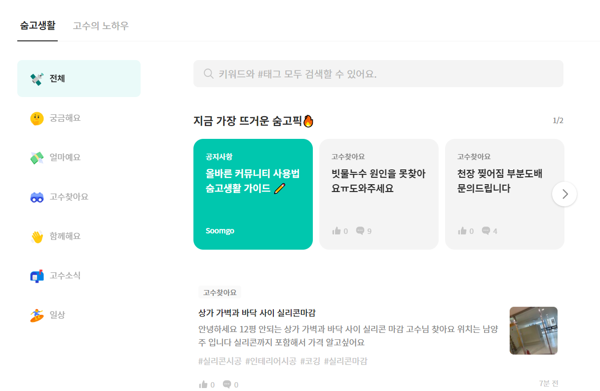

# soomgo




- 카테고리별 무한 스크롤
- 실시간 검색기능 구현 및 커뮤니티 기본 CRUD
- 게시글 좋아요, 북마크, 글 모아보기

## Specs

- `FE` React
- `BE` Spring

## 개발기간 및 팀원 소개

### 2022.07.29 ~ 2022.08.04

- FrontEnd - 전인호, 윤수영
- BackEnd - 신유근, 김태현, 문철현

## Installation (React)

```javascript
# Default.
@fortawesome/fontawesome-svg-core: "^6.1.2"
@fortawesome/free-solid-svg-icons: "^6.1.2"
@fortawesome/react-fontawesome: "^0.2.0"
@reduxjs/toolkit: "^1.8.3",
@tanstack/react-query: "^4.0.10"
@testing-library/jest-dom: "^5.14.1"
@testing-library/react: "^13.0.0"
@testing-library/user-event: "^13.2.1"
axios: "^0.27.2"
bootstrap: "^5.2.0"
eslint: "^8.20.0"
eslint-config-prettier: "^8.5.0",
json-server: "^0.17.0"
node-sass: "^7.0.1"
prettier: "^2.7.1"
prop-types: "^15.8.1"
react: "^18.2.0"
react-bootstrap: "^2.4.0"
react-dom: "^18.2.0"
react-hook-form: "^7.34.0"
react-icons: "^4.4.0"
react-redux: "^8.0.2"
react-router-dom: "^6.3.0"
react-scripts: "5.0.1"
react-slick: "^0.29.0"
redux: "^4.2.0"
slick-carousel: "^1.8.1"
styled-components: "^5.3.5"
swiper: "^8.3.2"
web-vitals: "^2.1.0"


# Start!
$ yarn start


# mock api.
$ yarn init -y
$ yarn add json-server
$ yarn json-server --watch db.json --port 5001

```
